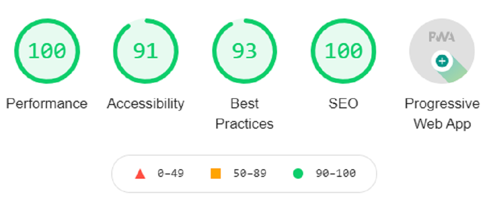
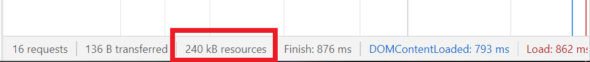
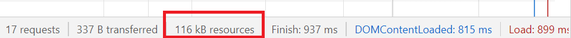

# NextJS Preact PWA Firebase Template

[Demo Site](https://next-preact-pwa-firebase.web.app) Performance:



## App Size (in Network Tab)
Without Preact:


With Preact:


This PWA Template is intended to be hosted on [Firebase](https://firebase.google.com)

The page is served with a Firebase Cloud Function.


## Getting Started

First, create a Firebase project in the [Firebase Console](https://console.firebase.google.com)

Clone the git repository:
```bash
git clone https://github.com/Fogeinator/next-pwa-firebase-template.git
# or your own username if you forked this template
```

Next, install dependencies in the `app/` folder:
```bash
cd app
npm install
```

Edit and rename the `dotfirebaserc`, `dotenv` and `firebase.json` files with your own config:

**`.firebaserc`**
```
{
    "projects": {
        "default": "my-firebase-project-id"
    }
}
```

[**`.env`**](https://nextjs.org/docs/basic-features/environment-variables)
```
FIREBASE_API_KEY="ABCDEFGHIJKLMNOPQRSTUVWXYZ"
...
```

Edit the `firebase.json` file and replace the hosting site with your own.
```
...
"hosting": [
	{
		"site": "YOUR FIREBASE HOSTING SITE",
		"public": "public/",
		"cleanUrls": true,
		"rewrites": [
			{
				"source": "**",
				"function": "nextjs-preactServer"
			}
		]
	}
]
```


## Developing your site

First, run the development server:

```bash
npm run dev
# or
yarn dev
```

Open [http://localhost:3000](http://localhost:3000) with your browser to see the result.

You can start editing the page by modifying `pages/index.js`. The page auto-updates as you edit the file.

You can also make your own Cloud Functions in the `functions/` folder.


## Deployment

After inputting all the configurations, run `npm run deploy` to build the NextJS app and deploy to Firebase Hosting


## Client-Side Firebase Integration

After editing the `.env` file, you can use Firebase in a page like so:

```js
import firebase from '../path/to/lib/firebase';

firebase.firestore().collection('foo').doc('bar').get()
.then(doc => {
    // do stuff
}).catch(err => console.error({ err }))
``` 

Alternatively, you can use [`useSWR`](https://github.com/vercel/swr) and query `api/my-collection` to get firebase data.

```jsx
import useSWR from 'swr'

const fetcher = async (...args) => {
    const res = await fetch(...args);
    return res.json();
};

export default function WaitableComponent() {
    const { data } = useSWR(`/api/my-collection`, fetcher, { refreshInterval: 6900 });
    if (data) { return <div>{data}</div> }
    else { return <div></div> }
}
```


## Learn More

To learn more about Next.js, take a look at the following resources:

- [Next.js Documentation](https://nextjs.org/docs) - learn about Next.js features and API.
- [Learn Next.js](https://nextjs.org/learn) - an interactive Next.js tutorial.

To learn more about Firebase, take a look at the following resources:
- [Firebase Documentation](https://firebase.google.com/docs) - learn about Firebase features and API.
- [Firebase YouTube Channel](https://www.youtube.com/user/Firebase) - Firebase's collection of videos.

To learn more about Preact, take a look at the following resources:

- [Preact Documentation](https://preactjs.com/) - learn more about Preact and its optimization.
- [Preact's Github Repo](https://github.com/preactjs/preact) - look at the source code of Preact.

## Credits

This template was based on [James Hegedus'](https://github.com/jthegedus/firebase-gcp-examples/tree/main/functions-nextjs) and [Developit's](https://github.com/developit/nextjs-preact-demo) repos :D